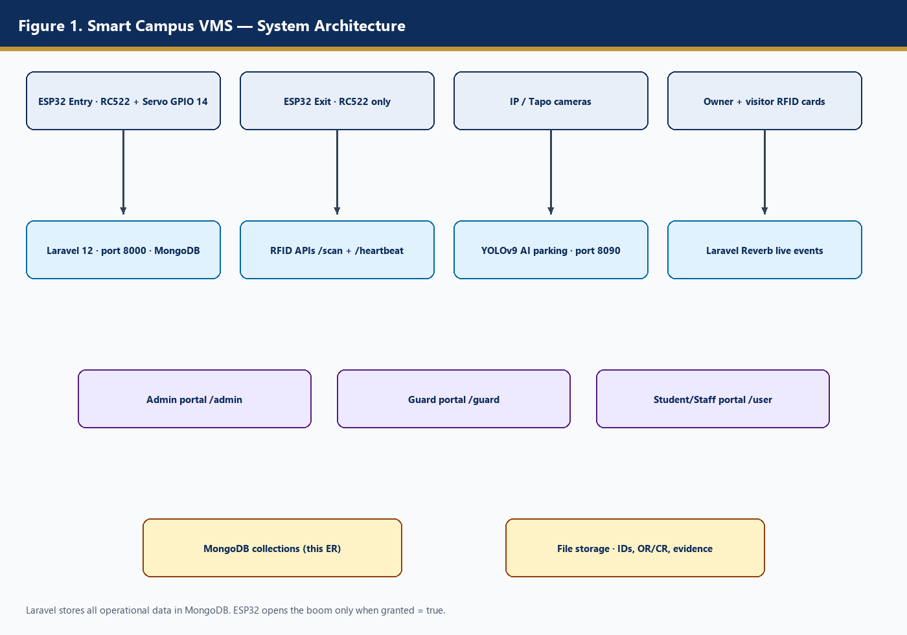
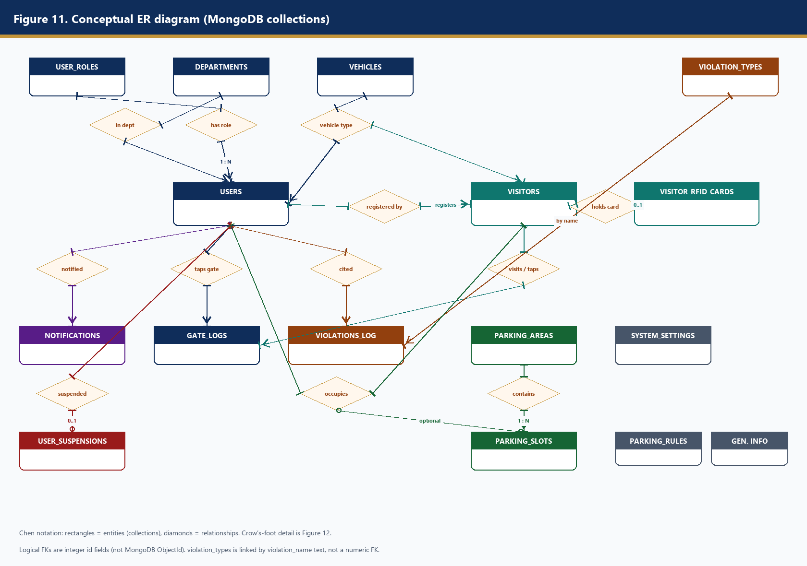
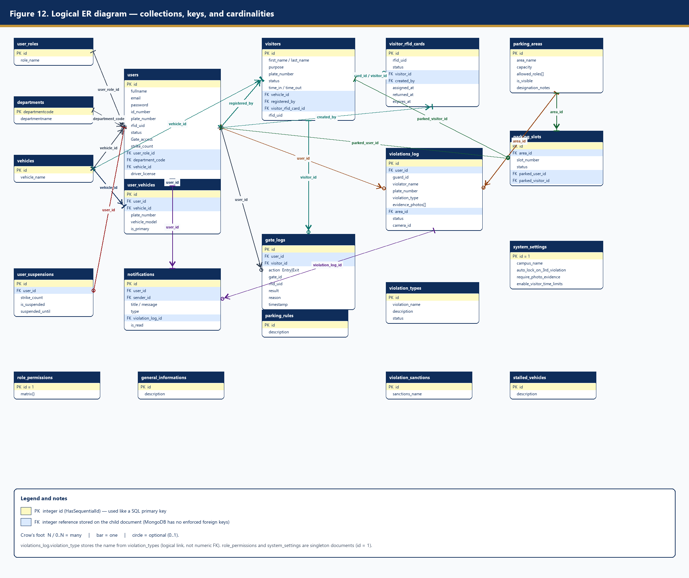
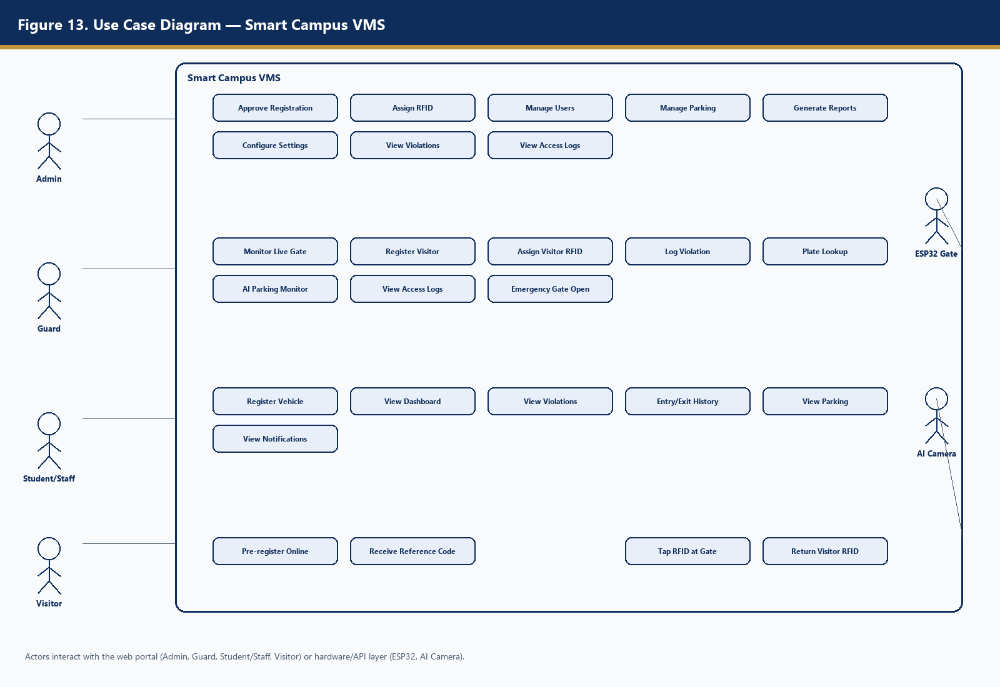
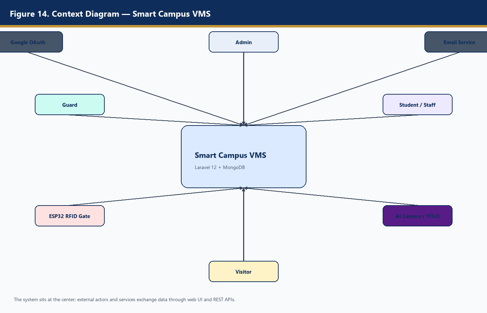
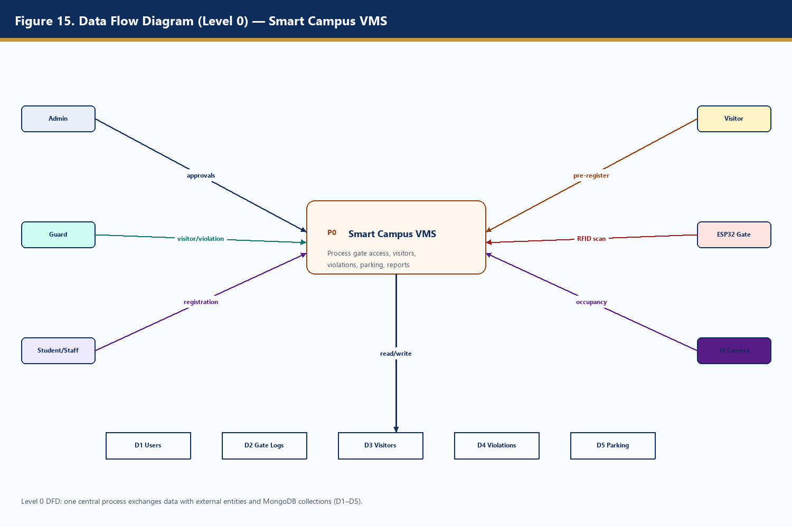
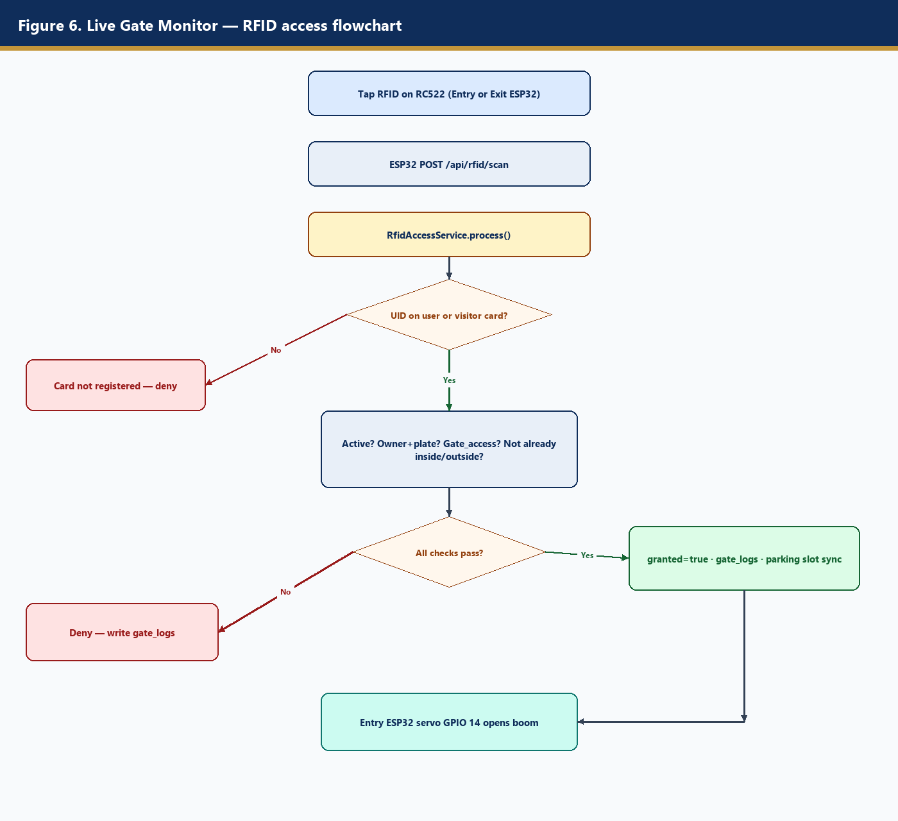
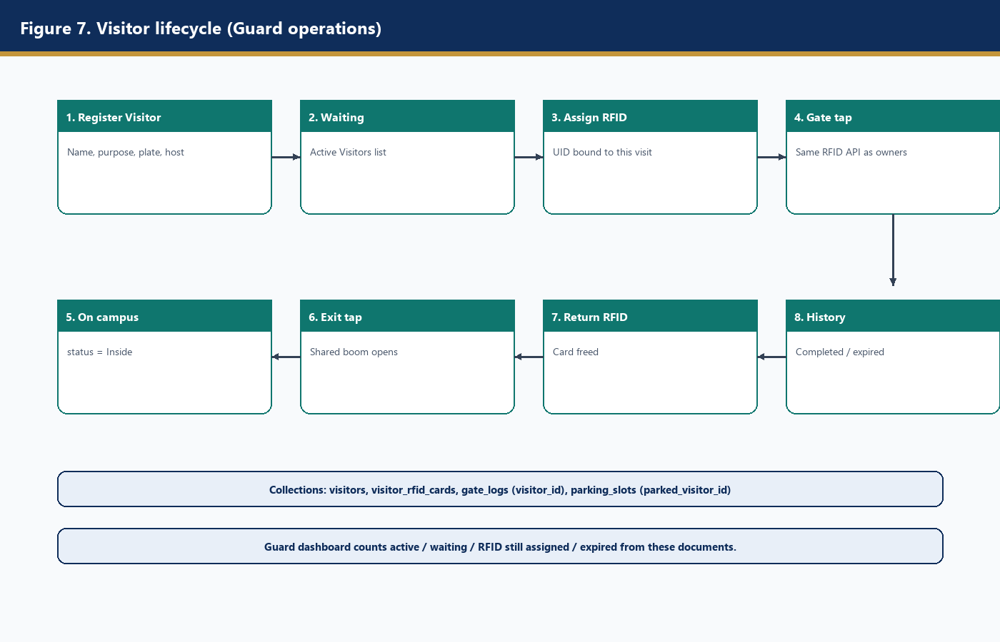
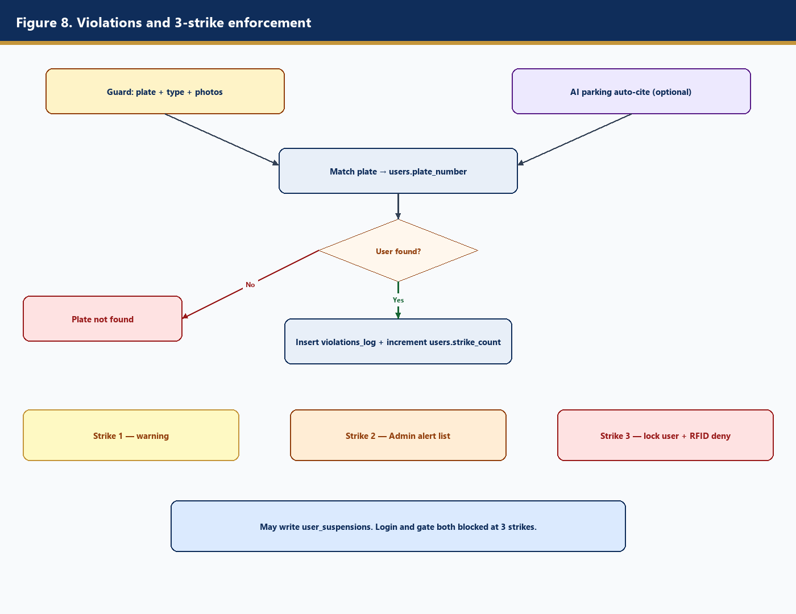
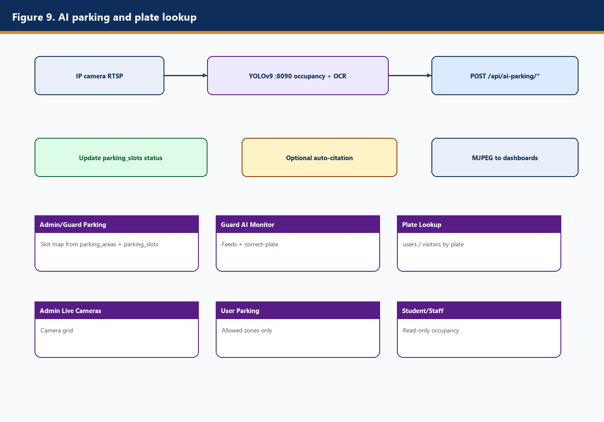

# 4.2 System Design

This section presents the architectural, database, and process design of the **Smart Campus Vehicle Management System (VMS)** for Camarines Sur Polytechnic Colleges (CSPC). The system integrates a Laravel 12 web application, MongoDB database, ESP32 RFID boom gates, and optional YOLOv9 AI parking cameras.

---

## 4.2.1 System Architecture Design

The Smart Campus VMS follows a **three-tier architecture** consisting of a presentation layer (web portals), an application layer (Laravel APIs and business logic), and a data/hardware layer (MongoDB, ESP32 gates, and AI cameras).

### Architecture Overview

| Layer | Components | Role |
|-------|------------|------|
| **Presentation** | Admin, Guard, and Student/Staff web portals; public registration and visitor pre-register pages | User interface for all roles |
| **Application** | Laravel 12 (port 8000), Laravel Reverb (WebSocket), REST APIs | Business rules, authentication, gate decisions, violation enforcement |
| **Data** | MongoDB (`capstone` database), file storage (documents, evidence) | Persistent storage of users, logs, visitors, violations, parking |
| **Hardware** | ESP32 Entry/Exit (RC522 RFID), IP/Tapo cameras, YOLOv9 service (port 8090) | Physical gate control and AI parking detection |

### Key Integration Points

- **ESP32 → Laravel:** `POST /api/rfid/scan` and `POST /api/rfid/heartbeat` with token authentication
- **YOLO → Laravel:** `POST /api/ai-parking/occupancy`, `/events`, `/plate-lookup` with AI token
- **Reverb → Guard UI:** Real-time gate scan events on Live Gate Monitor
- **Google OAuth / Email:** Optional sign-in and verification notifications

### System Architecture Diagram



*Figure 4.1 — System Architecture of Smart Campus VMS*

The architecture diagram shows how hardware devices (ESP32 gates, cameras, RFID cards) connect to the Laravel application, which stores all operational data in MongoDB and serves three role-based portals (Admin, Guard, Student/Staff).

---

## 4.2.2 Database Design

The system uses **MongoDB** as its primary database. Each Laravel Eloquent model maps to a MongoDB collection. Documents use a sequential integer `id` as a logical primary key (via `HasSequentialId`). Child documents store integer foreign keys; MongoDB does not enforce referential integrity — Laravel relationships enforce it at the application layer.

### Main Collections

| Collection | Purpose |
|------------|---------|
| `users` | Admin, Guard, Student, Staff accounts; plate, RFID UID, strikes, gate access |
| `user_roles` | Role names (Admin, Guard, Student, Staff) |
| `departments` | College/office codes |
| `vehicles` | Vehicle type lookup |
| `user_vehicles` | Multiple vehicles per registered user |
| `visitors` | Walk-in and pre-registered guests |
| `visitor_rfid_cards` | Temporary RFID pool for visits |
| `gate_logs` | Every RFID tap (Entry/Exit, granted/denied) |
| `parking_areas` | Parking lots/zones and allowed roles |
| `parking_slots` | Slot status; optional parked user or visitor |
| `violations_log` | Citations and evidence (3-strike system) |
| `violation_types` | Citation type catalog |
| `notifications` | In-app messages |
| `user_suspensions` | Account lock after 3 strikes |
| `system_settings` | Singleton app configuration |
| `parking_rules`, `general_informations` | Rules and notices shown on user dashboard |

### ER Diagram / Database Schema

**Conceptual ER (Chen notation):**



*Figure 4.2 — Conceptual Entity-Relationship Diagram*

**Logical ER (Crow's foot with attributes and cardinalities):**



*Figure 4.3 — Logical Entity-Relationship Diagram*

Full collection catalog and Mermaid ER: see [`docs/ERD.md`](ERD.md).

---

## 4.2.3 Process Design

Process design describes how users, hardware, and subsystems interact with the Smart Campus VMS through use cases, context boundaries, data flows, and detailed process flows for core features.

### 4.2.3.1 Use Case Diagram

The use case diagram identifies the main actors and their interactions with the system.

**Actors:**
- **Admin** — approves registrations, assigns RFID, manages users/parking, generates reports, configures settings
- **Guard** — monitors live gate, registers visitors, assigns/returns RFID, logs violations, plate lookup, AI parking monitor
- **Student/Staff** — registers vehicle, views dashboard, violations, entry/exit history, parking, notifications
- **Visitor** — pre-registers online, receives reference code, taps RFID at gate
- **ESP32 Gate** — sends RFID scans and heartbeat to API
- **AI Camera** — sends occupancy and detection events to API



*Figure 4.4 — Use Case Diagram*

---

### 4.2.3.2 Context Diagram

The context diagram shows the Smart Campus VMS as a single process at the center, surrounded by external entities that exchange data with it.

**External entities:**
- Admin, Guard, Student/Staff, Visitor (human users via web browser)
- ESP32 RFID Gate (hardware API)
- AI Camera / YOLO service (hardware API)
- Google OAuth (optional authentication)
- Email Service (verification and notifications)



*Figure 4.5 — Context Diagram*

The system receives registration data, gate scans, visitor records, violation reports, and AI occupancy updates. It outputs gate decisions, notifications, reports, and live dashboard updates.

---

### 4.2.3.3 Data Flow Diagram

The Level 0 Data Flow Diagram (DFD) shows the central process **P0: Smart Campus VMS** exchanging data with external entities and data stores.

**External entities:** Admin, Guard, Student/Staff, Visitor, ESP32 Gate, AI Camera

**Data stores (MongoDB collections):**
- **D1 Users** — accounts, RFID, strikes, gate access
- **D2 Gate Logs** — entry/exit audit trail
- **D3 Visitors** — visitor records and RFID assignments
- **D4 Violations** — citation logs and evidence
- **D5 Parking** — areas, slots, occupancy

**Main data flows:**
- Admin → approvals, settings, reports → P0 → D1, D5
- Guard → visitor registration, violations, gate commands → P0 → D2, D3, D4
- Student/Staff → registration, dashboard queries → P0 → D1, D2, D4
- Visitor → pre-registration → P0 → D3
- ESP32 → RFID scan/heartbeat → P0 → D2 (read/write D1, D3)
- AI Camera → occupancy/events → P0 → D5, D4



*Figure 4.6 — Data Flow Diagram (Level 0)*

---

### 4.2.3.4 RFID Gate Access Flow

The RFID gate access flow describes how an ESP32 reader processes a card tap and how Laravel grants or denies campus entry/exit.

**Process steps:**

1. User or visitor taps RFID card on ESP32 RC522 reader (Entry or Exit gate).
2. ESP32 sends `POST /api/rfid/scan` with `{ uid, gate_id, direction }`.
3. **RfidAccessService** looks up UID in `users.rfid_uid` or `visitor_rfid_cards`.
4. System validates: account active, gate access granted, not locked (3 strikes), correct Entry/Exit state (not already inside/outside).
5. **If granted:** create `gate_logs` record, return `{ granted: true, open_gate: true }`; Entry ESP32 activates servo (GPIO 14) to open boom; visitor status updated (Inside/Completed).
6. **If denied:** create `gate_logs` with reason, return `{ granted: false }`; red LED and buzzer activate.
7. ESP32 sends periodic heartbeat; Guard can queue emergency open via heartbeat response.



*Figure 4.7 — RFID Gate Access Flowchart*

---

### 4.2.3.5 Visitor Management Flow

Visitor management covers pre-registration, guard registration, RFID assignment, gate access, and card return.

**Process steps:**

1. **Pre-register (optional):** Visitor scans QR → fills public form → receives confirmation code (status: Waiting).
2. **Guard register:** Guard creates visitor record at booth (or finds pre-registered visitor by code).
3. **Assign RFID:** Guard links temporary `visitor_rfid_cards` UID to visitor.
4. **Entry:** Visitor taps RFID at Entry gate → `gate_logs` created → status: Inside.
5. **Exit:** Visitor taps RFID at Exit gate → boom opens → status updated.
6. **Return RFID:** Guard marks card returned → visitor status: Completed → card available for reuse.
7. **History:** Completed visits stored for Admin/Guard reporting.



*Figure 4.8 — Visitor Management Flow*

---

### 4.2.3.6 Violation Tracking Flow

The violation tracking flow implements the **3-strike enforcement policy** for campus parking and traffic rules.

**Process steps:**

1. Guard (or AI camera) identifies violation — plate number, type, photos.
2. System looks up owner by `users.plate_number`.
3. Create `violations_log` record with evidence; increment `users.strike_count`.
4. **Strike 1:** Warning notification and email to user.
5. **Strike 2:** Admin dashboard alert (2nd-strike watch list).
6. **Strike 3:** Account locked (`status = Locked`), gate access revoked, `user_suspensions` record created.
7. User views own violations in **My Violations** portal; Admin monitors all violations.



*Figure 4.9 — Violation Tracking and 3-Strike Flow*

---

### 4.2.3.7 AI Parking Monitoring Flow

AI parking monitoring uses YOLOv9 computer vision to detect vehicles, read plates, and update parking slot occupancy.

**Process steps:**

1. IP camera streams RTSP feed to YOLOv9 service (port 8090).
2. YOLO detects vehicles, reads plates (OCR), maps detections to parking slots.
3. Service sends `POST /api/ai-parking/occupancy` with slot status and detections.
4. Laravel updates `parking_slots` (Occupied/Available) and caches snapshot for dashboards.
5. Optional events (wrong zone, overstaying, unregistered plate) sent via `/api/ai-parking/events` → may auto-create `violations_log`.
6. Guard views **AI Parking Monitor** — live MJPEG stream, plate correction, occupancy counts.
7. Admin/Guard/User portals poll parking status for role-filtered zone display.



*Figure 4.10 — AI Parking Monitoring Flow*

---

## Diagram Index (Section 4.2)

| Section | Figure | File |
|---------|--------|------|
| 4.2.1 System Architecture | Fig 4.1 | `diagrams/fig01_architecture.png` |
| 4.2.2 Database (Conceptual ER) | Fig 4.2 | `diagrams/fig11_er_conceptual.png` |
| 4.2.2 Database (Logical ER) | Fig 4.3 | `diagrams/fig12_er_logical.png` |
| 4.2.3.1 Use Case | Fig 4.4 | `diagrams/fig13_use_case.png` |
| 4.2.3.2 Context | Fig 4.5 | `diagrams/fig14_context.png` |
| 4.2.3.3 DFD Level 0 | Fig 4.6 | `diagrams/fig15_dfd_level0.png` |
| 4.2.3.4 RFID Gate Access | Fig 4.7 | `diagrams/fig06_rfid_gate.png` |
| 4.2.3.5 Visitor Management | Fig 4.8 | `diagrams/fig07_visitor_flow.png` |
| 4.2.3.6 Violation Tracking | Fig 4.9 | `diagrams/fig08_violations.png` |
| 4.2.3.7 AI Parking | Fig 4.10 | `diagrams/fig09_ai_parking.png` |

### Regenerate all diagrams

```powershell
python docs/generate_system_diagrams.py
```
