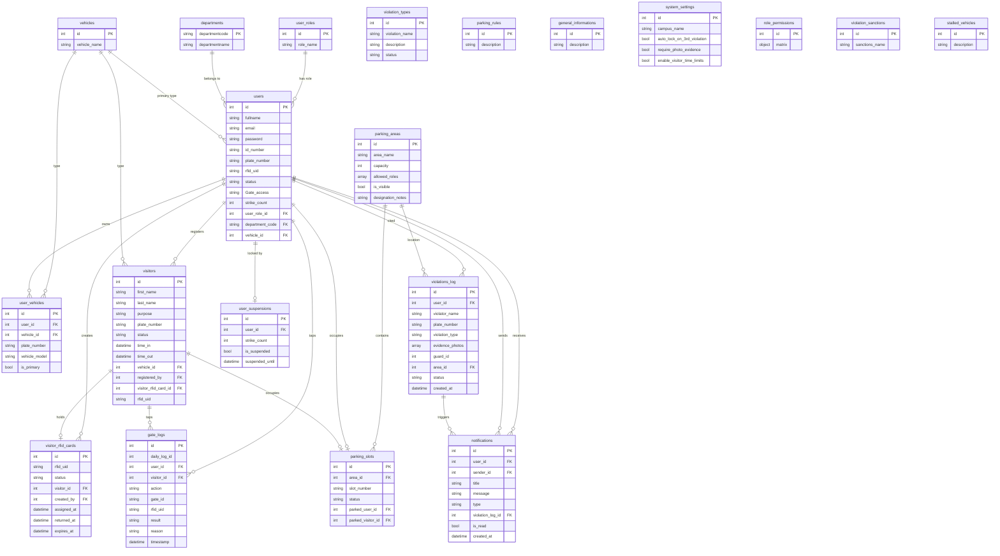

# Smart Campus VMS — Entity Relationship Diagram

The system stores data in **MongoDB** (database `capstone`). Each Laravel model maps to a collection. Documents use a sequential integer `id` as the logical primary key; child documents store integer foreign keys. MongoDB does not enforce FK constraints — Laravel relationships enforce them at the application layer.

## Logical ER diagram (Crow's foot)


## Conceptual ER diagram (Chen notation)


## Mermaid ER diagram



## Collection catalog

| Collection | Model | Purpose |
|---|---|---|
| `users` | User | Admin, Guard, Student, Staff accounts |
| `user_roles` | UserRole | Role names (Admin, Guard, Student, Staff) |
| `departments` | Department | College/office codes |
| `vehicles` | Vehicle | Vehicle type lookup (car, motorcycle, …) |
| `user_vehicles` | UserVehicle | Multiple vehicles per registered user |
| `visitors` | Visitor | Walk-in guests registered by Guard |
| `visitor_rfid_cards` | VisitorRfidCard | Temporary RFID pool for visits |
| `gate_logs` | GateLog | Every RFID tap (Entry/Exit, granted/denied) |
| `parking_areas` | ParkingArea | Parking lots/zones and allowed roles |
| `parking_slots` | ParkingSlot | Slot occupancy (user or visitor) |
| `violations_log` | ViolationLog | Citations and evidence (3-strike system) |
| `violation_types` | ViolationType | Citation type catalog (Admin settings) |
| `notifications` | Notification | In-app messages |
| `user_suspensions` | UserSuspension | Account lock after 3 strikes |
| `parking_rules` | ParkingRule | Rules shown on user dashboard |
| `general_informations` | GeneralInformation | Campus notices on user dashboard |
| `system_settings` | SystemSetting | Singleton app settings (`id = 1`) |
| `role_permissions` | RolePermission | Singleton permission matrix (`id = 1`) |
| `violation_sanctions` | ViolationSanction | Sanction name lookup |
| `stalled_vehicles` | StalledVehicle | Stalled-vehicle note lookup |

## Key relationships

- **users** → **user_roles**, **departments**, **vehicles** (lookup FKs on the user document)
- **users** → **user_vehicles** → **vehicles** (one user, many registered vehicles)
- **users** → **visitors** via `registered_by` (Guard registers guests)
- **visitors** ↔ **visitor_rfid_cards** (optional 0..1 card per visit)
- **gate_logs** links to either `user_id` **or** `visitor_id` (not both)
- **parking_slots** optionally occupied by `parked_user_id` **or** `parked_visitor_id`
- **violations_log.violation_type** stores the **name** from `violation_types` (logical link, not numeric FK)

## Regenerate diagrams

```powershell
python docs/generate_system_diagrams.py
```

Outputs:

- `docs/diagrams/fig11_er_conceptual.png` — Chen notation
- `docs/diagrams/fig12_er_logical.png` — Crow's foot with attributes
- `docs/Smart-Campus-VMS-Dashboards.docx` — Full documentation pack
